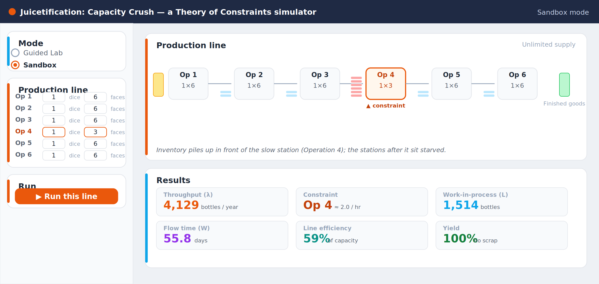
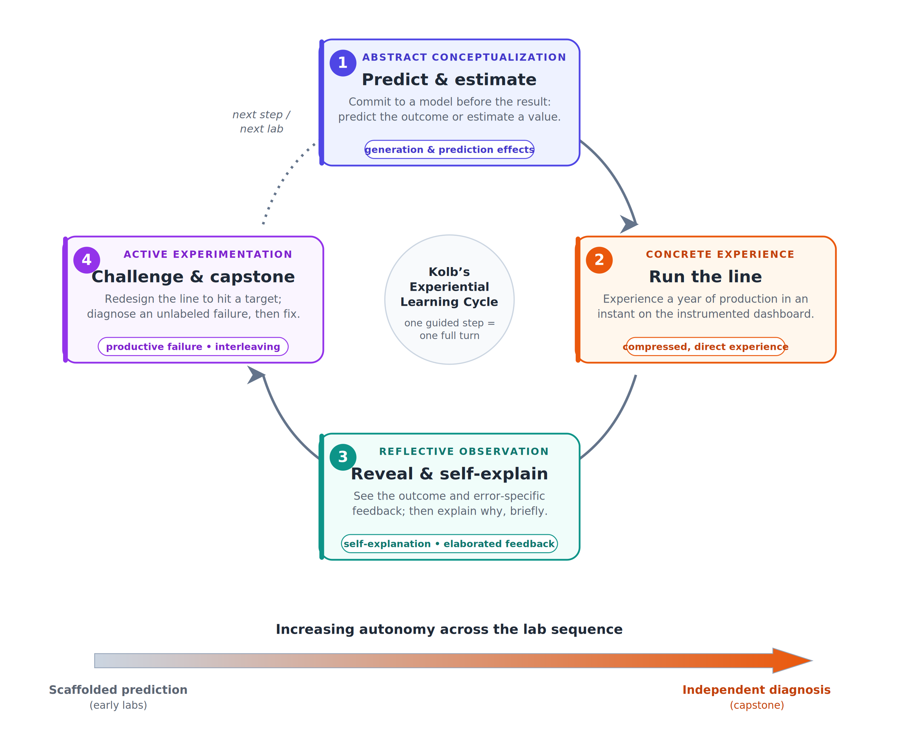

# 🧃 Juicetification: Capacity Crush

**An experiential, browser-based simulation for teaching the Theory of Constraints (TOC) and core operations-management concepts.**

Juicetification: Capacity Crush reimagines Goldratt's classic "dice game" as a juice-bottling
line. Students don't just *read* about bottlenecks, work-in-process, and yield — they run a line,
predict what will happen, watch it unfold, and then redesign it to hit a goal. The tool is built
around evidence-based learning mechanisms (prediction, elaborated feedback, self-explanation,
interleaving, and productive failure) so that the pedagogy is baked into the software rather than
left to facilitation.



---

## Why it exists

Operations concepts are famously counterintuitive: a balanced line finishes *below* the average
capacity of its stations; adding capacity to a non-constraint does nothing; capping work-in-process
shortens lead time without costing output; and a *fast* station can be the real constraint if it
scraps most of what it makes. Told these results in a lecture, students often assimilate them to
prior (wrong) intuitions. Juicetification makes each result something the student **predicts, sees,
and then has to engineer** — which is where the idea actually lands.

---

## Features

- **Sandbox mode** — a full dashboard with every control: per-station dice (capacity), work-in-process
  caps, supply reliability, demand variability, scrap/yield, safety stock, and the line's economics
  (throughput, operating expense, inventory investment, EOQ). Multi-year replications show the *distribution*
  of outcomes, not just one run.
- **Guided Lab mode** — a sequenced set of laboratories that introduce one concept at a time:
  1. Operations — the Five Focusing Steps
  2. Little's Law
  3. Push vs. Pull
  4. Variability
  5. Quality & Yield
  6. Economics of the line
  7. Throughput Accounting
  8. EOQ Drivers
  9. EOQ Limits
  10. Safety Stock
  11. **Capstone — Diagnose & Fix** (an interleaved, unlabeled diagnostic challenge)
- **Predict → Run → Reveal** on every step (commit to a prediction before you see the answer).
- **Distractor-specific feedback** — each wrong answer gets a one-line explanation aimed at the exact
  misconception behind it.
- **Numeric-estimate steps** graded on a tolerance band with a number-line readout.
- **Open design challenges** with an automated pass/fail check and limited tries.
- **Self-explanation prompts** after the key reveals; the count is folded into a tamper-evident
  completion code.
- **Progress tracking & completion codes** — students generate a checksum-protected code; instructors
  decode it to see per-lab completion and how many explanations were written.

---

## Quick start

**Requirements:** Python 3.9+ and the packages in `requirements.txt` (Streamlit and pandas).

```bash
# 1. (optional) create a virtual environment
python -m venv .venv && source .venv/bin/activate      # Windows: .venv\Scripts\activate

# 2. install dependencies
pip install -r requirements.txt

# 3. run the app
streamlit run juicetification.py
```

Streamlit will open the simulation in your browser (usually at http://localhost:8501).

---

## Using it in a course

- **Students** work through the Guided Labs in order; the Capstone is best saved for last. See
  `instructions.pdf` for a one-page visual guide.
- **Progress is stored in the page URL**, so a student can bookmark or copy the link to resume.
  Work runs entirely in the browser session — no accounts, no server-side data.
- **To collect work**, have each student open **Your progress → Get my completion code** and submit
  the generated code. Instructors decode it inside the same panel (paste the code into the decoder)
  to see per-lab completion, overall percentage, and the number of self-explanations written.
- **Everything is instructor-controllable**: the lab sequence, the difficulty of each challenge, and
  the number of tries are all defined in `juicetification.py`.

---

## Instructor configuration (Juicetification Director)

The app ships ready for the **Juicetification Director**, a shared system for setting up
configurable, per-section assignments without editing any code. Two small files provide it:
`juice_director.py` (identical across every simulation in the family — drop-in, never edited) and
`manifest.py` (this app's parameter schema). **If no Director parameters are present in the URL, the
app behaves exactly as it always has.**

- **Schema endpoint** — visiting `…/?manifest=1` returns this app's parameter schema as JSON, so the
  Director can discover the available settings (line configuration, WIP cap, supplier reliability,
  demand, scrap, and the economics) with no shared code.
- **Configured links** — the Director hands out a self-contained link (`…/?cfg=<encoded>`) that
  pre-fills the sidebar with the instructor's chosen starting values. The app accepts both the
  Director's parameter names and its own internal snapshot format, so older shared links keep working.
- **Reproducible runs** — adding `…/?seed=<number>` makes every student on the same assignment see the
  same random draws, which is useful for fair grading of an open design challenge. Without a seed, runs
  stay fully random.

No accounts or servers are involved; a configured assignment is just a URL.

### Per-student progress and stable scenarios

With storage configured (`student_store.py` — the same file every simulation in the family uses),
the app also saves each student's progress and gives each student a stable, unique line:

- **Sign-in gate** — when storage is on, students enter a student ID once (kept in the URL as
  `?sid=`), so a refresh or a return visit resumes exactly where they left off. When storage is off,
  there is no gate and nothing changes.
- **Automatic save/resume** — completed steps, reflections, challenge results, and lab position are
  written to encrypted per-student files after each meaningful step, and restored on load.
- **Stable per-student scenario** — the run seed is derived deterministically from the student ID, so
  the same student always faces the same line (and different students get different ones). This takes
  priority over the Director's `?seed=`; with neither, runs stay fully random.
- **Completion roster** — when a student generates their completion code, it is also recorded to
  storage so an instructor can assemble a roster.

Storage is enabled only when its secrets are set (`DB_ENCRYPTION_KEY` plus Dropbox credentials); it
requires the `dropbox` and `cryptography` packages, which are listed in `requirements.txt`. **With no
secrets set, every storage call is a safe no-op and the app runs exactly as it does standalone.**

## How the design maps to learning theory

The `paper/` folder contains the full manuscript describing the theoretical grounding and design
rationale, with figures. In brief, each guided step traverses Kolb's experiential learning cycle:



Additional figures in `figures/` illustrate the guided step, distractor feedback, numeric estimation,
the design challenge, the capstone diagnosis, and the self-explanation prompt.

---

## Repository contents

```
Juicetification-Capacity-Crush/
├── juicetification.py     # the simulation (single-file Streamlit app)
├── juice_director.py      # shared Director config loader (identical across apps)
├── manifest.py            # this app's parameter schema for the Director
├── student_store.py       # shared per-student progress store (identical across apps)
├── instructions.pdf       # one-page visual student guide
├── requirements.txt
├── README.md
├── LICENSE
├── paper/                 # academic write-up (design rationale + theory)
│   └── Juicetification_Capacity_Crush_Paper.docx
└── figures/               # publication-quality figures (PNG + editable SVG)
```

---

## Citing / attribution

If you use or adapt this simulation, please cite the accompanying paper (see `paper/`).
Author: Christopher M. Scherpereel, W. A. Franke College of Business, Northern Arizona University.

---

## License

Released under the MIT License (see `LICENSE`). You are free to use and adapt it for teaching and
research; please confirm this license suits your institution's requirements before publishing.

---

*Version 1.0*
